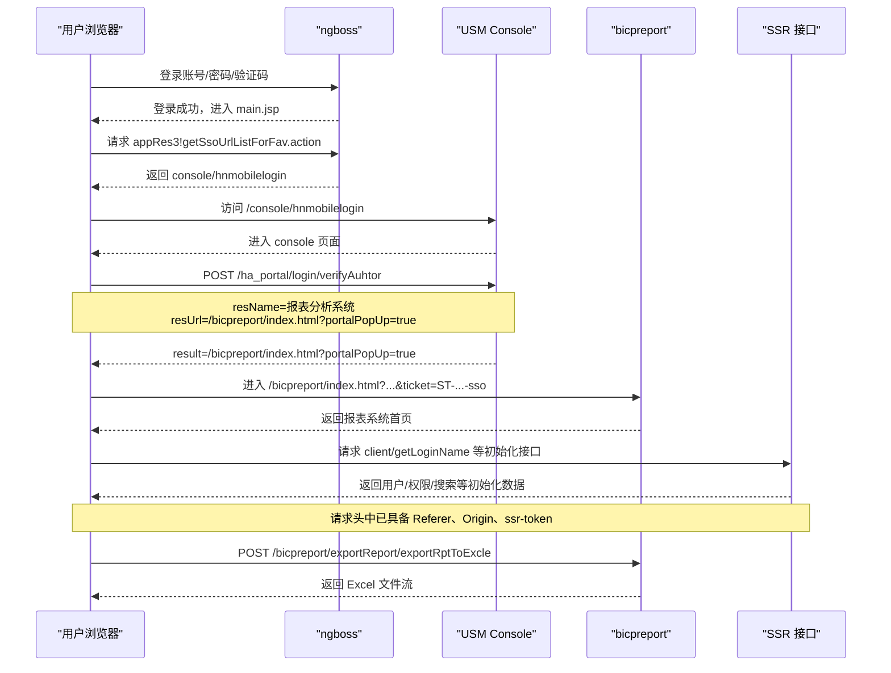

# SSO 导出认证流程说明

本文档基于以下 HAR 抓包整理：

1. `C:\Users\yuyu\Desktop\项目\log\ngboss.ha.cmcc.har`
2. `C:\Users\yuyu\Desktop\项目\log\usm.ha.cmcc.console.har`
3. `C:\Users\yuyu\Desktop\项目\log\usm.ha.cmcc.bicpreport.har`
4. `C:\Users\yuyu\Desktop\项目\log\usm.ha.cmcc.ssr.har`

目标是把“从统一门户登录，到最终导出报表 Excel”这条完整认证链路说明清楚，便于后续排查为什么代码请求会被重定向到登录页。

## 1. 总体结论

报表导出并不是“登录成功后直接拿 Cookie 请求导出接口”这么简单。

真实链路是：

1. 在 `ngboss` 完成统一门户登录
2. 由 `ngboss` 返回大数据平台的单点登录入口
3. 进入 `usm console`
4. 在 `console` 内对“报表分析系统”做一次授权落地
5. 带着 `ticket` 进入 `bicpreport`
6. 在 `bicpreport/ssr` 页面初始化过程中建立报表系统自己的请求上下文
7. 最后才能成功调用导出接口 `exportRptToExcle`

也就是说，导出接口依赖的不仅仅是最外层登录 Cookie，还依赖：

1. `console -> bicpreport` 的 SSO 落地过程
2. 进入报表系统时生成的 `ticket`
3. 页面初始化后形成的 `ssr-token`
4. 正确的 `Referer` 和 `Origin`

## 2. 网页跳转总览

从浏览器视角看，整体跳转顺序如下：

1. `ngboss` 登录页
2. `ngboss` 主框架页 `main.jsp`
3. `ngboss` 获取大数据平台 SSO 地址
4. 跳转到 `https://usm.ha.cmcc:19011/console/hnmobilelogin`
5. 进入 `usm console`
6. `console` 调用授权接口，目标系统为“报表分析系统”
7. 浏览器进入 `https://usm.ha.cmcc:19011/bicpreport/index.html?portalPopUp=true&ticket=ST-...-sso`
8. `bicpreport` 页面继续加载一系列 SSR 接口
9. 用户点击导出，调用 `POST /bicpreport/exportReport/exportRptToExcle`
10. 返回 Excel 文件流

## 3. 时序图



## 4. 分阶段说明

### 4.1 ngboss 统一门户登录

在 `ngboss.ha.cmcc.har` 中，可以看到登录成功后进入主框架页。

关键过程：

1. `login3!login.action` 登录成功
2. `isFirstLogin.action` 302 跳转
3. 最终进入 `main.jsp`

这一阶段的意义是：

1. 证明用户已经通过统一门户认证
2. 建立门户侧的会话

但这一步还不代表已经进入报表系统。

### 4.2 ngboss 返回大数据平台 SSO 入口

在 `ngboss.ha.cmcc.har` 中，关键请求是：

`POST /uac/web3/jsp/resource/app/appRes3!getSsoUrlListForFav.action`

这个接口返回了“大数据分析平台”的 SSO 地址，核心结果是：

`https://usm.ha.cmcc:19011/console/hnmobilelogin`

这一阶段的意义是：

1. `ngboss` 不直接把你送进报表系统
2. 它先告诉浏览器，要进入大数据平台，需要走 `console/hnmobilelogin`

这一步是 `ngboss -> usm` 的桥。

### 4.3 进入 USM Console

浏览器访问：

`https://usm.ha.cmcc:19011/console/hnmobilelogin`

在这一步，浏览器开始从统一门户上下文，切换到 USM 平台上下文。

这一阶段的意义是：

1. 建立 USM 平台自己的会话环境
2. 为后续进入具体业务系统做准备

### 4.4 Console 对报表分析系统做授权落地

在 `usm.ha.cmcc.console.har` 中，关键请求是：

`POST /ha_portal/login/verifyAuhtor`

请求体中最关键的字段有：

1. `resId: 55001000`
2. `resName: 报表分析系统`
3. `resType: APP`
4. `ssoType: UAP`
5. `resUrl: /bicpreport/index.html?portalPopUp=true`

接口返回：

```json
{
  "reCode": "0000",
  "reMsg": "success",
  "result": "/bicpreport/index.html?portalPopUp=true"
}
```

这一阶段的意义是：

1. 在 USM 内部确认“当前要进入的目标系统是报表分析系统”
2. 不是任意页面都能直接进，必须先经过这次授权确认

### 4.5 带 ticket 进入 bicpreport

真正进入报表系统时，浏览器地址已经变成：

`https://usm.ha.cmcc:19011/bicpreport/index.html?portalPopUp=true&ticket=ST-...-sso`

这里最关键的是 `ticket=ST-...-sso`。

这一阶段的意义是：

1. 说明用户不是裸进报表系统
2. 而是带着一次 SSO 凭证进入 `bicpreport`
3. 这个 `ticket` 是后续报表系统认可当前会话的重要依据

### 4.6 SSR 页面初始化

在 `usm.ha.cmcc.ssr.har` 和 `usm.ha.cmcc.bicpreport.har` 中，可以看到进入首页后，浏览器继续请求了很多接口，例如：

1. `client/getLoginName`
2. `ssopermission/queryallfunction`
3. `home/unifiedSearch`
4. 其他首页初始化和权限相关接口

这些请求的共同特点是：

1. `Referer` 指向带 `ticket` 的 `bicpreport/index.html`
2. `Origin` 是 `https://usm.ha.cmcc:19011`
3. 请求头中带有 `ssr-token`

这一阶段的意义是：

1. 报表系统首页不是静态页面
2. 页面初始化时会继续建立业务系统自己的请求上下文
3. `ssr-token` 很可能就是导出接口要求的关键凭证之一

### 4.7 最终导出 Excel

在 `usm.ha.cmcc.bicpreport.har` 中，最终成功导出时，请求为：

`POST /bicpreport/exportReport/exportRptToExcle`

从 HAR 可见的核心特点：

1. 请求方式是 `POST`
2. 请求体是表单参数
3. 请求头带有 `Origin`
4. 请求头带有 `Referer`
5. 请求头带有 `ssr-token`
6. 响应是 Excel 文件流，而不是 HTML 页面

抓包里出现的核心业务参数包括：

1. `area=371`
2. `templateId=86283`
3. `sheetName=日通报`
4. `versionName=20260421`
5. `resId=513958`
6. `param_key=key`
7. `param_value=...`
8. `key=0000`
9. `downloadXlsx=false`

返回结果是：

`application/octet-stream;charset=utf-8`

这说明导出是成功的文件流响应，不是被重定向到登录页。

## 5. 为什么代码里直接请求导出接口会失败

当前项目里，如果代码只是：

1. 登录
2. 取 Cookie
3. 直接请求 `exportRptToExcle`

那服务端很可能返回：

1. `302` 跳转到 `/sso/login.action?...`
2. 或者直接返回 HTML 登录页

根因不是“账号没登录”，而是“没有完成报表系统自己的认证落地”。

缺失的关键链路通常包括：

1. 没有先访问 `console/hnmobilelogin`
2. 没有执行 `verifyAuhtor`
3. 没有带着 `ticket` 进入 `bicpreport`
4. 没有建立 `ssr-token`
5. 没有复用正确的 `Referer` / `Origin`

所以问题不在于“导出参数是否正确”，而在于“导出前置认证上下文是否完整”。

## 6. 对当前项目的启发

这条链路说明，项目里的下载逻辑如果想稳定成功，不能只做“拿 Cookie 后直接请求导出接口”，而应该理解为两段：

1. 认证预热
2. 正式导出

认证预热至少要覆盖：

1. 从门户进入 USM
2. 从 USM 进入报表分析系统
3. 带 `ticket` 落地到 `bicpreport`
4. 建立 SSR 页面上下文

正式导出阶段才是：

1. 携带完整上下文
2. 请求 `exportRptToExcle`
3. 获取 Excel 文件

## 7. 一句话总结

这套系统的真实访问顺序是：

`ngboss 登录 -> main.jsp -> 获取 usm SSO 地址 -> console/hnmobilelogin -> verifyAuhtor 授权报表分析系统 -> bicpreport/index.html?ticket=... -> SSR 初始化 -> exportRptToExcle`

当前“代码请求导出被重定向到登录页”的根因，本质上就是跳过了中间这段 SSO 落地和业务系统上下文建立过程。

## 8. 代码视角的流程映射

上面的内容是“浏览器真实发生了什么”，下面这一节对应到项目代码，说明当前自动化项目是怎么组织的。

### 8.1 Flow 编排层

主流程在：

`flows/notify_single_flow.py`

从代码职责上看，这个 Flow 主要负责：

1. 读取任务配置和报表配置
2. 先准备登录态
3. 再执行下载
4. 再执行比对
5. 如果有变化则继续更新模板、截图、发送、提交

核心流程可以概括为：

1. `load_config` 读取 `config/tasks/*.json`
2. `prepare_session_task(...)` 准备 Cookie
3. `download_reports_task(...)` 下载报表
4. `compare_report_task(...)` 比对新旧 Excel
5. `update_template_task(...)` 更新模板
6. `build_message_package_task(...)` 生成发送包
7. `send_notification_package_task(...)` 发送企业微信
8. `commit_template_task(...)` 发送成功后提交正式模板

也就是说，Flow 已经把“登录、下载、比对、发送”这些阶段串起来了，整体架构没有问题。

### 8.2 会话准备层

会话准备逻辑在：

`services/session_manager.py`

它当前主要做的是：

1. 读取 `cookie_dump.json`
2. 校验 Cookie 是否存在、是否过期、是否包含需要的 `stage`
3. 如果 Cookie 无效，则执行 `login_command`
4. 再把登录产出的 Cookie 同步回 `runtime/cookies/cookie_dump.json`

从代码实现上看，`prepare_session(...)` 的核心目标是：

1. 让后续下载步骤能拿到某个 `stage` 对应的 Cookie
2. 避免每次都重新登录

这一步解决的是“有没有基础 Cookie”的问题。

它目前还没有解决的是：

1. 登录完成后，是否真正进入了 `usm console`
2. 是否完成了 `verifyAuhtor`
3. 是否拿到了 `bicpreport` 侧需要的 `ticket`
4. 是否建立了 `ssr-token`

所以它更像是“门户级会话准备”，不是“报表导出级认证准备”。

### 8.3 下载执行层

下载逻辑在：

`services/method_service.py`

当前关键实现是：

1. 从 `cookie_dump.json` 中按 `stage` 取 Cookie
2. 组装请求头
3. 调用 `requests.Session().request(...)`
4. 直接请求配置里的下载 URL
5. 如果响应是 HTML，则认为 session 已过期

关键代码行为可以概括为：

1. `find_stage(...)` 根据 `report.stage` 找 Cookie 分组
2. `build_cookie_jar(...)` 把该 stage 的 Cookie 装进 Session
3. `build_headers(...)` 从 Cookie 中提取头字段，例如 `ssr-token`
4. `request_report(...)` 直接请求目标 URL
5. `download_one_report(...)` 判断是否返回了 HTML 登录页

这套实现对“简单下载接口”是成立的，但对当前报表系统不够。

原因是当前实现默认认为：

1. 只要 `stage` 对应的 Cookie 存在
2. 再补几个请求头
3. 就可以直接调用导出接口

而 HAR 已经证明，真实系统不是这样工作的。

### 8.4 当前代码和真实链路的对应关系

可以把“真实网页行为”和“项目当前代码”做一个映射：

| 真实链路阶段 | 当前项目是否已覆盖 | 当前对应代码 | 说明 |
| --- | --- | --- | --- |
| `ngboss` 登录 | 已覆盖 | `services/session_manager.py` | 通过 `login_command` 和 Cookie dump 完成 |
| 获取 Cookie 分组 `stage` | 已覆盖 | `prepare_session(...)` + `method_service.find_stage(...)` | 已能按 `report_analysis` 等 stage 取 Cookie |
| 访问 `console/hnmobilelogin` | 未显式覆盖 | 无 | 当前代码没有在下载前主动执行这一步 |
| `console -> verifyAuhtor` | 未覆盖 | 无 | 当前没有专门的授权落地请求 |
| 带 `ticket` 进入 `bicpreport/index.html` | 未覆盖 | 无 | 当前没有页面预热过程 |
| 建立 `ssr-token` 上下文 | 部分依赖已有 Cookie | `build_headers(...)` | 只能从已有 Cookie 取值，无法主动建立 |
| 请求导出接口 | 已覆盖 | `request_report(...)` | 但当前是“直接请求”，容易被重定向 |

从这个映射就能看出来：

当前代码并不是“完全不能工作”，而是“只实现了前半段和最后一步，中间最关键的 SSO 落地没补齐”。

## 9. 当前 Flow 为什么会出现两类结果

从项目运行现象看，当前一般会出现两类结果。

### 9.1 正常拿到文件

出现这种情况时，通常意味着：

1. 当前 `cookie_dump.json` 恰好还保留了足够完整的上下文
2. 对应 `stage` 里刚好含有有效会话
3. 某些必须的头字段也刚好能从 Cookie 中映射出来

这时 `method_service.py` 虽然没有显式补链路，但因为上下文碰巧完整，所以导出能成功。

### 9.2 被重定向到登录页

出现这种情况时，通常意味着：

1. `ngboss` 层 Cookie 还在
2. 但 `bicpreport` 侧的上下文已经不完整
3. `ssr-token`、`ticket`、业务系统会话或 Referer 条件不满足

这时 `download_one_report(...)` 会发现响应是 HTML，并抛出：

`下载响应为 HTML（可能是登录页），session 已过期`

这里的“session 已过期”更准确地说，不一定是统一门户 Cookie 真的过期了，而是：

1. 对导出接口来说，报表系统上下文不完整
2. 服务端于是把请求重新导向 SSO 登录页

## 10. 对代码设计的启发

站在当前项目结构上，这条链路说明后续如果要让导出稳定，最合理的设计不是推翻现有 Flow，而是在现有分层里补一层“认证预热”。

最自然的位置是下载服务层，也就是：

`services/method_service.py`

原因是：

1. Flow 层已经很清晰，负责编排，不适合塞太多 HTTP 细节
2. Session 管理层目前偏向 Cookie 生命周期管理
3. 真正与“导出前先做什么预热请求”最相关的，是下载服务

换句话说，未来如果要扩展，最像下面这个思路：

1. `prepare_session` 负责“我有没有基本登录态”
2. `method_service` 负责“我在请求导出前，是否已经完成报表系统预热”
3. Flow 只负责“先登录，再下载，再比对，再发送”

这样既不破坏现有架构，也符合当前项目“flows 只编排、services 放业务逻辑”的设计原则。

## 11. 推荐的阅读顺序

如果后续要继续排查或改造，建议按这个顺序看代码：

1. `flows/notify_single_flow.py`
先看 Flow 是怎么串起来的，理解整个执行顺序。

2. `services/session_manager.py`
再看登录态是怎么准备、校验和复用的。

3. `services/method_service.py`
最后看导出请求是如何构造的，以及为什么当前会直接撞到导出接口。

配合本文件前半部分的网页跳转说明，可以比较容易定位：

1. 哪些步骤浏览器做了，但代码没做
2. 哪些请求头是从 Cookie 提出来的
3. 哪些上下文目前还没有自动建立
