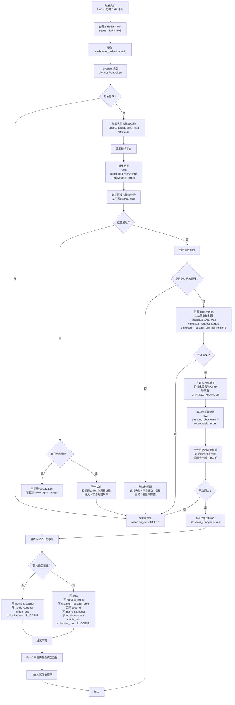

# 数据驾驶舱完整收缩流程图

下面流程图描述的是按推荐目标收缩后的完整链路，覆盖会话、采集、校验、结构漂移、重采、最终事务和查询展示。



核心边界：

```text
失败时只写运行状态和失败报告；
成功时才在最终短事务里写正式结构和正式指标。
```

当前结构边界：

```text
request_target:
  CITY / BRANCH / GRID / CHANNEL_MANAGER

area:
  CITY / BRANCH / GRID / CHANNEL

channel_manager_area:
  CHANNEL_MANAGER -> CHANNEL
```

关键规则：

```text
不请求 CHANNEL；
GRID 响应用于发现 CHANNEL_MANAGER；
CHANNEL_MANAGER 响应用于采集 CHANNEL 指标，并同步 manager-channel 关系；
第二轮必须完整通过后，才允许提交 area / request_target / channel_manager_area / metric_*。
```

代码中的结构图对象：

```text
StructureGraph
  areas:
    CITY / BRANCH / GRID / CHANNEL
  targets:
    CITY / BRANCH / GRID / CHANNEL_MANAGER
  edges:
    GRID -> CHANNEL_MANAGER
    CHANNEL_MANAGER -> CHANNEL
```

变化检测：

```text
current_graph = load_current_structure_graph(...)
observed_graph = build_observed_structure_graph(...)
graph_diff = diff_structure_graph(current_graph, observed_graph)
```

只要 `graph_diff` 中出现新增、减少、改名、关系变化，就会触发候选结构重采。

重采策略：

```text
默认推荐方案 A：
  日常第一轮按当前 request_target 正常采集；
  如果 graph_diff 只影响部分 GRID，则第二轮只重采受影响 GRID 子树。
  最终 rows 由第一轮未受影响部分 + 第二轮受影响子树合并。

低峰校准可选方案 C：
  先请求所有 GRID 做结构探测；
  再按最新候选 request_target 正式采指标。
```

选择原因：

```text
渠道变化通常很少；
日常采用局部重采，请求量最小；
低峰再做全量结构探测，补充长期结构校准。
```
