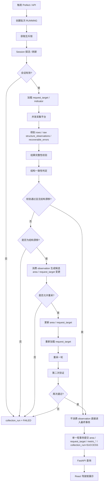

# 数据驾驶舱采集与结构同步推荐流程图

## 1. 设计目标

本流程基于以下原则重排：

- 先采集
- 先校验
- 采集阶段只收集 observation，不立即消费
- 只有校验失败并确认结构漂移时才更新 `area` / `request_target`
- 校验通过后再进入最终 MySQL 短事务提交

这样做的目标是：

- 减少无效结构写入
- 提高完整性
- 避免实时任务被结构修复拖慢
- 把最终业务结果与结构修复分层

说明：

- `area` 是数据库表
- `request_target` 是数据库表
- `area_map` 不是表，而是运行时从 `area` 表加载出来的内存映射

---

## 2. 推荐流程图（文本版）

```text
1. 触发与会话
   Prefect / API 手动触发
        ↓
   创建批次 collection_run = RUNNING
        ↓
   获取互斥锁
        ↓
   Session 探活 / 必要时刷新登录
        ↓
   会话有效？
      ├─ 否 → collection_run = FAILED，结束
      └─ 是 → 进入采集

2. 平台采集
   加载当前 request_target / indicator
        ↓
   按 target 并发请求平台
        ↓
   得到：
   - rows
   - raw structure_observations
   - recoverable_errors

   说明：
   - 这里只收集 observation
   - 不更新 area
   - 不更新 request_target

3. 首轮校验与判定
   基于当前数据库结构（area / request_target / area_map）
   对本轮 rows 做校验：

   3.1 结果完整性校验
   - 区域是否缺失
   - 是否有重复
   - 指标是否有效

   3.2 结构一致性判定
   - 当前结果是否和现有 area / request_target 一致
   - 是否真的出现结构漂移证据

   分支判断：

   A. 校验通过 + 无结构漂移
      → 不消费 observation
      → 不更新 area
      → 不更新 request_target
      → 直接进入最终事务

   B. 校验失败 + 确认为结构漂移
      → 开始消费 observation
      → 生成候选 area / request_target 变更
      → 判断是否允许重采
         ├─ 允许重采 → 更新结构后重采一轮
         └─ 不允许重采 → collection_run = FAILED，结束

   C. 校验失败 + 非结构问题
      → 不消费 observation
      → 不更新 area
      → 不更新 request_target
      → collection_run = FAILED，结束

4. 重采分支（仅结构漂移时）
   根据本轮 observation 生成候选结构变更
   - 更新 area
   - 更新 request_target
        ↓
   重新加载 request_target
        ↓
   再采一轮
        ↓
   第二次验证（与首轮同级，必须再次通过）
        ↓
   通过？
      ├─ 否 → collection_run = FAILED，结束
      └─ 是 → 进入最终事务

5. 最终 MySQL 事务
   单一短事务提交：
   - area
   - request_target
   - metric_snapshot
   - metric_current / metric_acc
   - collection_run = SUCCESS
        ↓
   提交成功
        ↓
   查询接口可见最新结果

6. 查询与展示
   FastAPI 查询
        ↓
   React 驾驶舱展示最新一次成功数据
```

---

## 3. 核心变化

```text
旧流程：
采集 → 立刻同步 area / request_target → 再校验

调整后：
采集 → 先校验 → 只有校验失败且确认结构漂移时，才消费 observation 并同步 area / request_target
```

---

## 4. 关键决策表

```text
校验通过 + 无结构漂移
→ 不动结构表
→ 不消费 observation
→ 直接写指标

校验失败 + 结构漂移
→ 才消费 observation
→ 才更新 area / request_target
→ 视情况重采
→ 重采后必须再次验证，只有再次通过才允许最终提交

校验失败 + 非结构问题
→ 不更新结构
→ 不消费 observation
→ 直接失败
```

---

## 5. Mermaid 图



---

## 6. 状态机与提交边界

### 6.1 不通过时允许做什么

不通过时，允许：

- 保留本轮采集结果：`rows`、`raw structure_observations`、`recoverable_errors`
- 基于 observation 在内存中生成候选结构：
  - `candidate_area_map`
  - `candidate_request_targets`
- 用候选结构判断：
  - 是否存在结构漂移
  - 是否值得重采
  - 重采应该增加哪些 target
- 如果决定重采，可以基于候选结构发起第二轮采集

说明：

- 这里允许“推导结构”
- 不允许“正式落库”

### 6.2 不通过时不允许做什么

不通过时，不允许：

- 正式写 `area` 表
- 正式写 `request_target` 表
- 正式写 `metric_snapshot`
- 正式写 `metric_current / metric_acc`
- 将 `collection_run` 标记为 `SUCCESS`

失败时数据库里只允许更新：

- `collection_run.status`
- `collection_run.phase`
- `collection_run.error_type`
- `collection_run.error_message`
- 以及必要的日志/诊断信息

### 6.3 通过后提交什么

只有在以下条件满足时，才允许进入最终事务：

- 校验通过
- 如果存在结构漂移，已经通过候选结构重采验证成功
- 本批次最终确认有效

此时按两种情况提交：

#### A. 结构没变

事务提交：

- `metric_snapshot`
- `metric_current / metric_acc`
- `collection_run = SUCCESS`

#### B. 结构变了

事务提交：

- `area`
- `request_target`
- `metric_snapshot`
- `metric_current / metric_acc`
- `collection_run = SUCCESS`

### 6.4 状态机

```text
START
  ↓
SESSION_OK
  ↓
COLLECTED
  ↓
VALIDATING
  ↓
结果有效？
  ├─ 是
  │    ↓
  │  结构变化？
  │    ├─ 否 → 直接提交 metric_* + SUCCESS
  │    └─ 是 → 提交 area + request_target + metric_* + SUCCESS
  │
  └─ 否
       ↓
     结构漂移？
       ├─ 否 → FAILED（只写 run 状态）
       └─ 是
            ↓
          生成候选结构（内存）
            ↓
          是否允许重采？
            ├─ 否 → FAILED（只写 run 状态）
            └─ 是 → RETRY_COLLECT
```

### 6.5 原则总结

一句话概括：

- 失败时只更新“运行状态”
- 成功时才更新“正式结构和正式结果”

---

## 7. 不通过后的处理说明

这一部分必须单独说明清楚，因为“不通过”并不等于立刻改库，也不等于一定要重采。

### 7.1 首轮校验不通过时，先做什么

首轮校验不通过后，系统先不正式写：

- `area`
- `request_target`
- `metric_snapshot`
- `metric_current / metric_acc`

而是先做两件事：

1. 判断这次失败是不是“结构漂移”导致的
2. 如果是结构漂移，再基于 observation 推导候选结构

也就是说：

- 先判断原因
- 再决定是否需要消费 observation
- 再决定是否需要重采
- 不是一失败就立刻写结构表

### 7.2 首轮不通过时的三种分支

#### A. 校验失败，但不是结构问题

例如：

- 请求超时
- 平台短时漏数
- 指标为空
- 某些返回异常，但没有结构变化证据

处理：

- 不消费 observation
- 不更新 `area`
- 不更新 `request_target`
- 不写指标表
- 只更新 `collection_run = FAILED` 和 failure report

#### B. 校验失败，且确认结构漂移

例如：

- 出现新的正式区域
- 出现新的 `CHANNEL_MANAGER`
- 现有 `request_target` 已无法覆盖真实平台结构
- 父子关系明显变化

处理：

- 消费 observation
- 在内存中生成候选结构：
  - `candidate_area_map`
  - `candidate_request_targets`
- 判断是否允许重采

这时仍然只是“候选结构”，还不是正式写库。

#### C. 校验通过

处理：

- 不消费 observation
- 不更新 `area`
- 不更新 `request_target`
- 直接进入最终事务，写指标结果

### 7.3 允许重采时会发生什么

只有在“校验失败 + 确认结构漂移 + 允许重采”同时满足时，才会进入重采分支。

流程：

1. 使用 observation 生成候选结构
2. 更新候选 `area / request_target`
3. 重新加载候选 `request_target`
4. 再采一轮
5. 再做一次完整验证

关键点：

- 重采不是成功证明
- 第二次验证通过，才代表修复成功
- 第二次验证不通过，仍然要失败

### 7.4 重采后再次验证通过时，才允许正式提交

第二次验证通过后，才允许进入最终短事务。

按结构是否变化分成两类：

#### 结构没变

提交：

- `metric_snapshot`
- `metric_current / metric_acc`
- `collection_run = SUCCESS`

#### 结构变了

提交：

- `area`
- `request_target`
- `metric_snapshot`
- `metric_current / metric_acc`
- `collection_run = SUCCESS`

### 7.5 重采后仍不通过时

如果第二次验证仍不通过：

- 不提交 `area`
- 不提交 `request_target`
- 不提交指标表
- 只更新：
  - `collection_run = FAILED`
  - `phase`
  - `error_type`
  - `error_message`
  - failure report JSON

一句话概括：

- 首轮不通过：先判断原因，不急着改库
- 结构漂移：可生成候选结构并重采
- 重采后仍不通过：仍然失败，不写正式结果
- 只有最终通过：才正式提交结构和指标

---

## 8. 当前实现与目标流程差异

当前代码还没有完全切换到本文件描述的目标流程，至少还有这些差异：

- 当前实现里，`area` / `request_target` 仍有“采后即同步”的路径残留
- observation 已经会在采集阶段生成，但主流程还没有完全做到“只在失败后才消费”
- 当前重采触发条件仍然偏严格，容易放大实时任务耗时

所以这份文档描述的是推荐重构后的流程，不是当前代码已经完全达到的状态。

---

## 9. 已确认的运行约束与排障结论

### 9.1 请求约束

已经确认：

- `REALTIME` 请求使用：`getDetailByAreaAndIndex`
- `DAY_ACC` / `MONTH` 请求使用：`getDetailsByDateAndArea`
- `city_ops` 采集请求必须带 `Uaptoken`，不能只带 cookie

### 9.2 运行时长分析结论

目前已经确认：

- 单请求并不慢，样本请求约 `0.05s ~ 0.5s`
- session 前置耗时约 `1.8s`
- 预加载 `targets + indicators` 约 `0.5s`
- 当前实时批次 `target_count` 约为 `699`
- 4~5 分钟总耗时不是单请求慢导致，而更可能是整批采集、严格校验和可能的重采共同造成

### 9.3 失败与锁冲突

已经出现过的真实问题包括：

- `dashboard_collection.lock` 导致的并发锁冲突
- `area` 同步阶段的 `autoflush + MySQL timeout`
- 失败批次写统一 JSON 报告

### 9.4 失败报告目录

当前统一失败目录为：

- `runtime/dashboard/failure_reports/`

说明：

- 所有失败都应写原因到该目录下的 JSON
- `VALIDATE_AREA` 详细异常仍会保留在：`runtime/dashboard/area_anomalies/`
- `collection_run.error_message` 中应包含 `report_path`

---

## 10. 结论

推荐将当前数据驾驶舱流程进一步调整为：

- 采集阶段只负责收集结果与 observation
- 校验通过时不更新结构表
- 只有校验失败且确认结构漂移时，才消费 observation 并更新候选结构
- 失败时只更新批次运行状态，不正式写结构表和指标表
- 成功时再将需要生效的结构和指标通过短事务一次性提交

这样可以：

- 减少无效数据库写入
- 避免实时模式因结构同步导致重采和耗时扩大
- 提高批次完整性
- 更准确地区分“结构问题”和“采集问题”
- 明确失败时与成功时的数据库提交边界
- 让“不通过之后发生什么”具备稳定且可解释的规则
