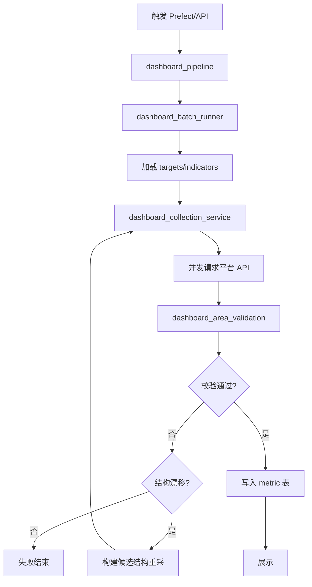

# 数据驾驶舱 (Dashboard) 文件说明

## 概述

数据驾驶舱是一个自动化数据采集系统，从业务平台实时采集指标数据，经过校验后存储到 MySQL，并通过 FastAPI + React 前端展示。

---

## 核心流程

```
触发(Prefect/API) → 批次创建 → 会话准备 → 并发采集 → 校验 → 写入指标 → 展示
```

---

## 服务层 (services/)

### 入口管道

| 文件 | 作用 |
|------|------|
| `dashboard_pipeline.py` | 主入口，通用采集管道入口。支持 REALTIME/DAY_ACC/MONTH 三种周期类型，协调整个采集流程 |
| `dashboard_batch_runner.py` | 批次运行时上下文管理。创建数据库会话、加载采集目标、管理互斥锁、处理异常 |

### 采集相关

| 文件 | 作用 |
|------|------|
| `dashboard_collection_service.py` | 并发采集核心。从平台 API 并行请求指标数据，支持 GRID/CHANNEL_MANAGER/BRANCH/CITY 等目标类型 |
| `dashboard_simple_collection.py` | 简化版采集器。封装请求参数构建、错误重试、session 管理等细节 |
| `dashboard_trigger.py` | 触发与时间工具。生成批次号、获取上海时间、处理会话登录等 |

### 校验与结构

| 文件 | 作用 |
|------|------|
| `dashboard_area_validation.py` | 区域校验。验证采集结果与已知区域是否匹配，处理结构漂移检测 |
| `dashboard_collection_orchestrator.py` | 采集编排与结构同步核心。协调采集→校验→重采→最终事务提交，实现"先校验后同步"逻辑 |

### 存储相关

| 文件 | 作用 |
|------|------|
| `dashboard_metric_store.py` | 指标存储。原子写入 metric_current/metric_snapshot/metric_acc 表 |
| `dashboard_retention_service.py` | 数据清理。清理过期的 snapshot 和 run 记录 |

### 查询与展示

| 文件 | 作用 |
|------|------|
| `dashboard_query_service.py` | 查询服务。为 FastAPI 提供指标数据查询接口 |

### 辅助工具

| 文件 | 作用 |
|------|------|
| `dashboard_area_import.py` | 从 Excel 导入区域结构 |
| `dashboard_request_target_import.py` | 从 Excel 导入采集目标 |
| `dashboard_failure_report.py` | 失败报告写入工具 |
| `dashboard_wide_refresh.py` | 刷新物化视图 |

---

## 数据模型 (models/)

| 文件 | 作用 |
|------|------|
| `dashboard_base.py` | 基础模型类，所有模型的基类 |
| `dashboard_area.py` | Area 表。存储正式区域（城市/支公司/网格/渠道） |
| `dashboard_request_target.py` | RequestTarget 表。存储采集目标（GRID/CHANNEL_MANAGER 等） |
| `dashboard_indicator.py` | Indicator 表。存储指标定义 |
| `dashboard_metric.py` | 指标表：MetricCurrent(当前值)、MetricSnapshot(快照)、MetricAcc(累计值) |
| `dashboard_collection_run.py` | CollectionRun 表。存储批次运行记录 |

---

## 基础设施 (infrastructure/)

| 文件 | 作用 |
|------|------|
| `dashboard_run_store.py` | 批次状态存储。管理 collection_run 表的读写 |
| `dashboard_mysql.py` | MySQL 连接创建 |

---

## API 层 (backend/)

| 文件 | 作用 |
|------|------|
| `routers/dashboard.py` | FastAPI 路由，提供指标查询、批次状态等接口 |
| `app.py` | FastAPI 应用入口 |

---

## 前端 (admin_react/)

| 目录/文件 | 作用 |
|-----------|------|
| `src/components/dashboard/` | React 驾驶舱页面组件 |
| `src/lib/api.ts` | API 调用封装 |

---

## 配置

| 文件 | 作用 |
|------|------|
| `config/dashboard/session.json` | 会话配置（cookie、token 等） |
| `config/dashboard/indicators.json` | 指标定义配置 |

---

## 流程图



---

## 关键设计原则

1. **先校验后同步**：采集数据先校验，只有确认结构漂移才更新结构表
2. **候选结构**：重采时在内存构建候选结构，不立即写库
3. **短事务提交**：最终成功时一次性提交结构和指标
4. **并发采集**：使用 ThreadPoolExecutor 并行请求，目标间互不影响
