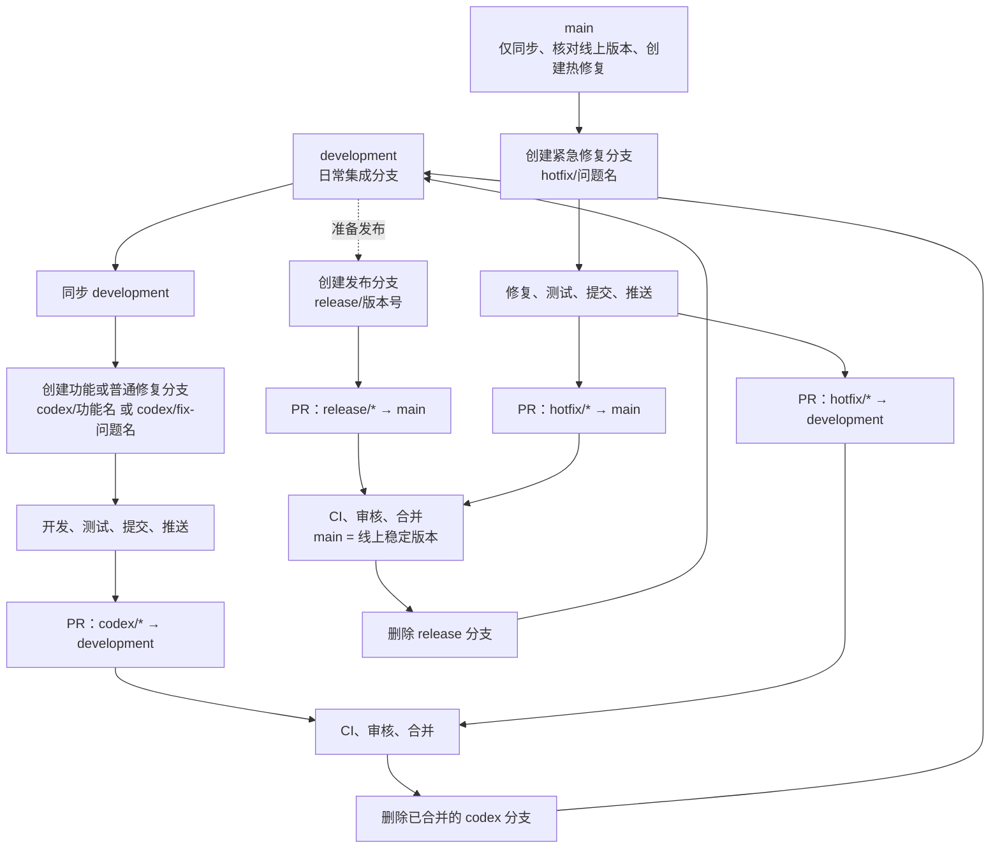
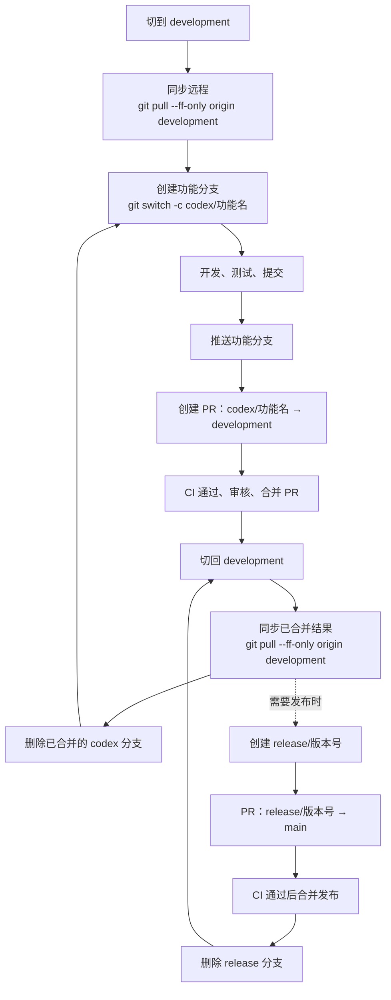
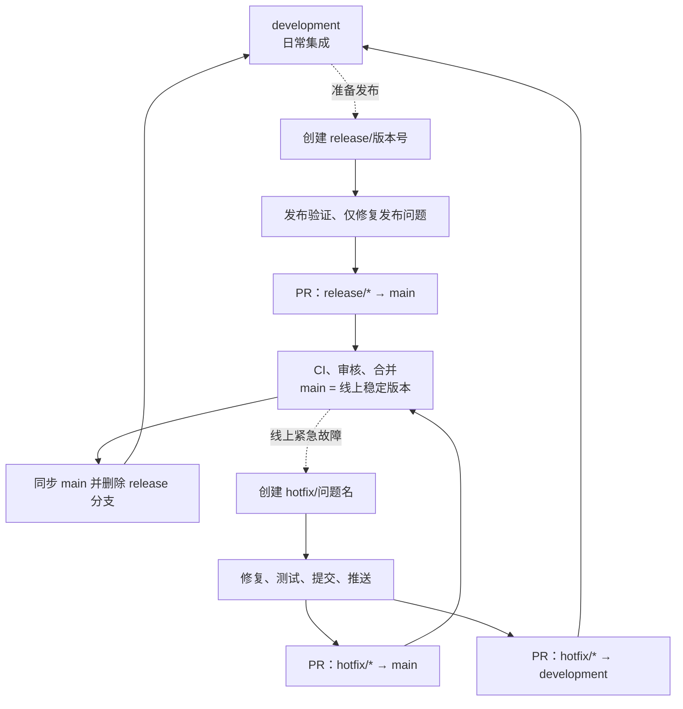

# Git 分支、测试与发布流程

本文定义自动通报项目的日常开发、发布和线上紧急修复流程。远程受保护分支只能通过 Pull Request（PR）合并，不能直接推送。

## 分支职责

| 分支 | 用途 | 生命周期 |
| --- | --- | --- |
| `main` | 已发布、可部署到生产环境的稳定版本 | 长期保留 |
| `development` | 日常功能集成与下一次待发布版本 | 长期保留 |
| `codex/<short-description>` | 一项功能、普通缺陷修复或文档改动 | 合并到 `development` 后删除 |
| `release/<version>` | 一次发布的候选版本，例如 `release/1.0.2` | 合并到 `main` 后删除 |
| `hotfix/<short-description>` | 已上线生产故障的紧急修复 | 同时合入 `main` 和 `development` 后删除 |

本地 `main` 是远程 `origin/main` 的镜像：用于核对线上版本、创建热修复和验证发布结果。日常功能开发不需要切换或同步本地 `main`。

## 总体流程



## 日常开发循环

每个新需求、普通缺陷或文档改动都从最新 `development` 创建独立的 `codex/*` 分支。不要从上一个 `codex/*` 分支继续创建下一个功能分支。

### 1. 同步集成分支并创建功能分支

```powershell
git switch development
git pull --ff-only origin development
git switch -c codex/add-dashboard-export
```

### 2. 开发、验证、提交和推送

```powershell
# 执行与改动相匹配的测试
git add <文件路径>
git commit -m "feat: add dashboard export"
git push -u origin codex/add-dashboard-export
```

### 3. 创建并合并 PR

在 GitHub 创建：

```text
codex/add-dashboard-export → development
```

CI 通过并完成审核后，在 GitHub 合并 PR；不要直接推送 `development`。

### 4. 清理并开始下一个循环

```powershell
git switch development
git pull --ff-only origin development
git branch -d codex/add-dashboard-export
git push origin --delete codex/add-dashboard-export

git switch -c codex/next-feature
```

如果 GitHub 合并 PR 时已自动删除远程分支，最后一条删除远程分支的命令会提示分支不存在，可直接跳过。

## 常规发布

发布从已同步的 `development` 创建 `release/*` 分支，而不是在本地将 `development` 直接合并到 `main`。

```powershell
git switch development
git pull --ff-only origin development
git switch -c release/1.0.2
git push -u origin release/1.0.2
```

创建发布 PR：

```text
release/1.0.2 → main
```

发布分支只接受发布验证期间必要的修复、版本说明和部署调整，不加入新功能。CI 和审核通过后，由 GitHub 合并到受保护的 `main`。

发布完成后：

```powershell
git switch main
git pull --ff-only origin main
```

若发布分支上发生了修复，且这些修复不在 `development`，还要创建：

```text
release/1.0.2 → development
```

完成后删除本地和远程 `release/1.0.2` 分支。

## 线上紧急修复

只有已上线的生产问题才从 `main` 创建 `hotfix/*`：

```powershell
git switch main
git pull --ff-only origin main
git switch -c hotfix/fix-login-timeout
```

修复、测试、提交并推送后，创建两个 PR：

```text
hotfix/fix-login-timeout → main
hotfix/fix-login-timeout → development
```

第一个 PR 用于紧急发布，第二个 PR 将同一修复带回下一版本，避免后续发布覆盖该修复。两个 PR 都合并后再删除 `hotfix/*` 分支。

## PR 对照表

| 场景 | 来源分支 | PR 目标 |
| --- | --- | --- |
| 新功能、普通修复、文档更新 | `codex/<short-description>` | `development` |
| 常规发布 | `release/<version>` | `main` |
| 发布期间修复回流 | `release/<version>` | `development`（仅在需要时） |
| 线上紧急修复 | `hotfix/<short-description>` | `main` 和 `development` |

## 保护规则和提交约定

- `main` 与 `development` 禁止直接推送和强制推送。
- 合并前必须通过 CI；单人维护时至少保留 CI 门禁。
- 必须使用 PR 合并受保护分支。
- 使用清晰的提交前缀：`feat:`、`fix:`、`docs:`、`test:`、`refactor:`、`chore:`。
- `git pull` 只同步当前本地分支，不创建 PR，也不替代代码审查。

## 附录：日常 `codex` 开发循环



| 步骤 | 操作 | 目的 |
| --- | --- | --- |
| 1 | 切到 `development` | 确保新工作从团队当前的集成基线开始。 |
| 2 | `git pull --ff-only origin development` | 获取已合并的其他功能；`--ff-only` 会在本地历史意外分叉时停止，避免自动制造合并提交。 |
| 3 | 创建 `codex/<short-description>` | 将一项需求或普通修复隔离，避免未完成工作影响 `development`。 |
| 4 | 开发、运行测试、提交 | 在功能分支内完成改动并留下可审查的提交记录。 |
| 5 | 推送功能分支 | 把分支发布到远程，供 CI 和 PR 使用。 |
| 6 | 创建 `codex/* → development` PR | 让变更经过差异审查，并让 CI 在目标分支规则下验证。 |
| 7 | 合并 PR | 只有 CI 和审核满足要求时，功能才进入日常集成分支。 |
| 8 | 切回并同步 `development` | 让本地分支包含刚合并的功能和同期其他人的改动。 |
| 9 | 删除已合并的 `codex/*` 分支 | 清理短生命周期分支；下一个功能必须从更新后的 `development` 新建。 |

## 附录：发布与线上热修复循环



| 步骤 | 操作 | 目的 |
| --- | --- | --- |
| 1 | 从 `development` 创建 `release/<version>` | 冻结这次发布的内容，让 `development` 可以继续接收下一版本的功能。 |
| 2 | 在 `release/*` 验证并仅修复发布问题 | 保持发布范围可控；不在发布候选中加入新需求。 |
| 3 | 创建 `release/* → main` PR | 受保护的 `main` 只能通过 PR、CI 和审核接收生产版本。 |
| 4 | 合并后同步本地 `main` | 本地 `main` 跟随线上稳定版本，用于核对生产版本或创建热修复。 |
| 5 | 删除已完成的 `release/*` | 发布分支是临时分支；若它包含 `development` 没有的修复，应先创建回流 PR。 |
| 6 | 从 `main` 创建 `hotfix/*` | 仅在生产故障时使用，确保修复基于实际在线版本。 |
| 7 | 创建 `hotfix/* → main` PR | 将紧急修复尽快、安全地发布到生产。 |
| 8 | 创建 `hotfix/* → development` PR | 将同一修复带回下一版本，避免以后发布时把线上修复覆盖掉。 |
